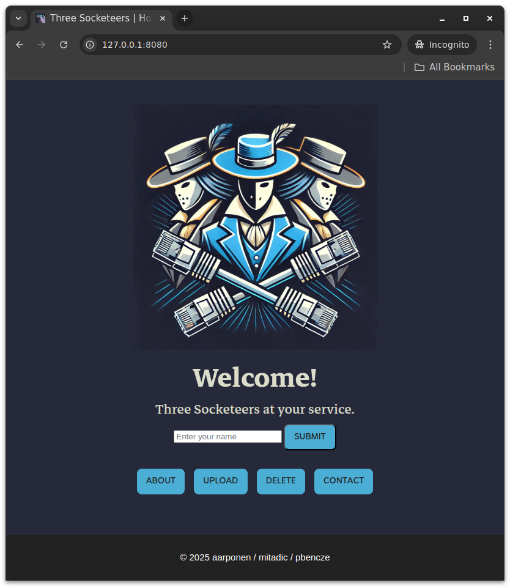
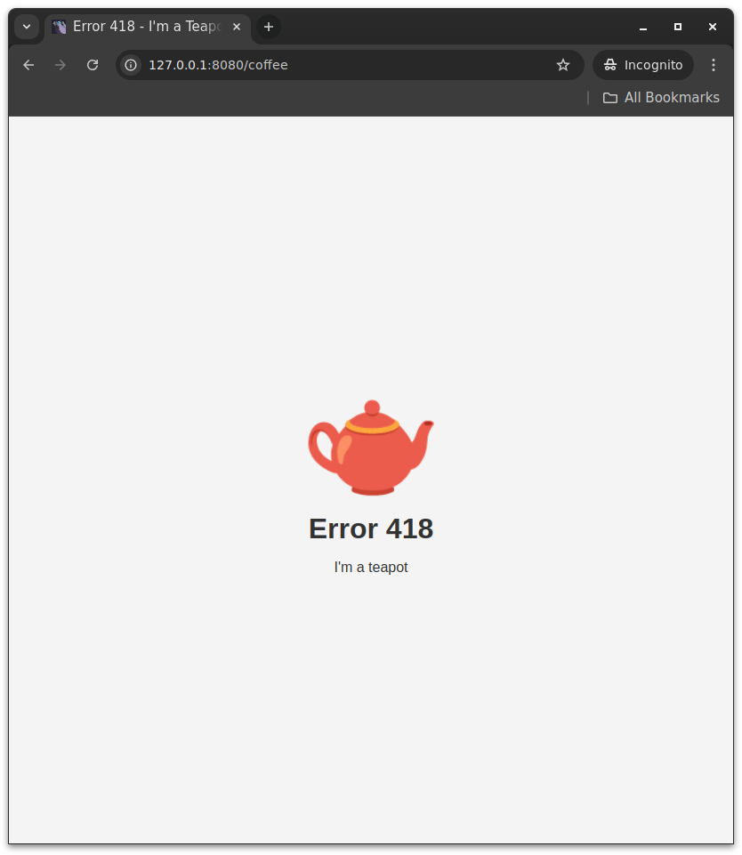

# Webserv

Project by [@mitadic](https://github.com/mitadic), [@chilituna](https://github.com/chilituna) and [@pebencze](https://github.com/pebencze). 🚀🌐

## Table of Contents
- [About](#about)
- [Usage](#usage)
- [Configuration File](#configuration-file)
- [Features](#features)
- [Terminology](#terminology)
- [Resources](#resources)

## About

Webserv is a rudimentary HTTP server built using C++ 98 and [poll()](https://man7.org/linux/man-pages/man2/poll.2.html), with no external libraries utilized. It can serve both static files from a root directory and dynamic content using CGI (Common Gateway Interface), as it is compliant with RFC 2616 and RFC 3875.

<p float="left">
	
	
	
</p>

## Usage

### 1. Build the Project
To compile the project after cloning and entering the cloned directory, run:
```bash
make
```

### 2. Run the Server
#### Using the Default Config File
```bash
./webserv
```

#### Using a Custom Config File
```bash
./webserv [config_file]
```

#### Setting a Custom Debug Level
You can specify debug levels: `SETUP`, `DEBUG`, `INFO`, `WARNING`, or `ERROR`. The default one is `INFO`.
```bash
./webserv [debug_level]
```

### 3. Make Requests
#### Using a Web Browser
Open your browser (e.g., Chrome) and navigate to:
```
http://127.0.0.1:8080
http://127.0.0.2:9090
```

#### Using Telnet
```bash
telnet localhost 8080
```

#### Using cURL
```bash
# Example GET request
curl -v http://localhost:8080/index.html

# Example DELETE request
curl -X DELETE http://localhost:8080/uploads/hi.txt

# Example POST request (uploading a file)
curl -v -X POST http://localhost:8080/uploads -F "file=@test.txt"
```

### 4. Run our End-To-End Tests
```bash
make test
```

## Configuration File

Our configuration file is inspired by the default NGINX configuration. It uses a simple structure with **server blocks** that listen on specific IP addresses and ports. Each server block can include **location directives** to define rules or configurations for specific paths.

### Directives

Here are the available directives and their purposes:

- **`host [ip address]`**
	Specifies the IP address the server will bind to.

- **`listen [port number]`**
	Defines the port number the server will listen on.

- **`client_max_body_size [number of bytes]`**
	Sets the maximum allowed size for the client request body.

- **`error_page [status code] [relative path]`**
	Sets a custom error page for a specific HTTP status code.

- **`root [root of the location]`**
	Specifies the root directory for serving files.

- **`index [default page to be served]`**
	Defines the default file to serve when accessing a directory.

- **`allowed_methods [GET , POST , DELETE]`**
	Allows HTTP methods for a location.

- **`autoindex [on || off]`**
	Enables or disables directory listing when no index file is found.

- **`upload [path to upload folder]`**
	Specifies the directory where uploaded files will be stored.

- **`return [status code] [new location]`**
	Redirects requests to a new location with a specific status code.

- **`cgi_extension [.py , .sh , .php]`**
	Defines the file extensions that will be processed using CGI.

### Example Configuration

This example demonstrates a basic configuration with a root directory, an upload location, and a custom error page.

```conf
server {
	host 127.0.0.1;
	listen 8080;

	client_max_body_size 10485760;

	error_page 404 /404.html;

	location / {
		root /var/www/html;
		index index.html;
		allowed_methods GET;
	}
}
```

## Features
* Navigate through .html pages (GET) - Response: 200 OK
	* Requesting directory loads index.html if available
	* Navigating above root not allowed (URL gets sanitized)
	* Log visited pages to page_visits.log
* Browse through uploads via directory listing (GET) - Response: 200 OK
* Submit message via contact form (POST(application/x-www-form-urlencoded) and CGI) - Response: 201 Created
	* Messages are decoded and saved to a form_submissions.log
* Upload files (POST (multipart/form-data) and CGI) - Response: 201 Created
	* Upload requests are logged in files.log
* Delete files (DELETE) - Response 204 No Content
	* Delete requests are logged in files.log
* Cookies (three-socketeers)
	* Session ID is created a saved for each client
	* Clients can enter and change their name, which is saved in "name" cookie
* Redirection - Response: 301/302 depending if the redirection is temporary or permanent
* Executing CGI scripts based on certain extensions
* Non-blocking server

## The Status Codes utilized
Meaning | Code | Scenario Example
:--- | :--- | :---
OK | 200 | Generic "all good". E.g. page delivered
Created | 201 | Confirming upload or form submission
Accepted | 202 | Confirming arrival (noncommittal)
Moved Permanently | 301 | Try to not ask for this URI in the future
Found | 302 | You can expect to find stuff at this URI later again
Temporary Redirect | 307 | Same semantics as `302`, but method must persist
Permanent Redirect | 308 | Same semantics as `301`, but method must persist
Bad Request | 400 | Generic "it's not me it's you"
Forbidden | 403 | Directory deletion not allowed, missing index.html, etc
Not found | 404 | No resource at specified URI
Method not allowed | 405 | Trying to `DELETE` at specific location 
Not Acceptable | 406 | Client does not accept file type
Request Timeout | 408 | Connection established but no request ever came in
Length Required | 411 | A `POST` request needs either `Content-Length` or `Transfer-Encoding` information
Content Too Large | 413 | Request body is larger than limits defined by server
URI Too Long | 414 | Longer than default (Webserv sets 4096)
Unsupported Media Type | 415 | Format not supported by the server
I'm a teapot | 418 | You asked for coffee in the URI and Webserv refused
Internal Server Error | 500 | Generic "it's not you it's me"; undisclosed backend failure
Not Implemented | 501 | e.g. method DELETE in a CGI request, not a feature of Webserv
Service Unavailable | 503 | Conventionally sent with a `Retry-After`
Gateway Timeout | 504 | CGI timeout
HTTP Version Not Supported | 505 | e.g. HTTP/2.0


## Terminology
### NGINX

NGINX (used by Netflix, Instagram etc.) is a high-performance web server designed for handling a large number of connections. Among many other protocols it supports HTTP/1.1. Nginx has a lot of useful features that our program does not have, e.g. it is a reverse proxy, it supports SSL/TLS and streaming.


### HTTP

The Hypertext Transfer Protocol (HTTP) is an application-level
protocol for distributed, collaborative, hypermedia information
systems.

The overall protocol as defined in RFC 2616:

> "The HTTP protocol is a request/response protocol. A client sends a
request to the server in the form of a request method, URI, and
protocol version, followed by a MIME-like message containing request
modifiers, client information, and possible body content over a
connection with a server. The server responds with a status line,
including the message's protocol version and a success or error code,
followed by a MIME-like message containing server information, entity
metainformation, and possible entity-body content."
>
### Web Server
The term can refer to hardware or software or both working together. A web server software controls how users can access hosted files. An HTTP server can be accessed through the domain names of the websites it stores. On the hardware side, the web server stores the software and the website’s component files (HTML docs, images, CSS sheets). It connects to the internet and supports data exchange with *clients*.

### Non-Blocking
##### Blocking (Kerrisk 2010, page 1325):
> "Most of the [core linux programs] employ an I/O model under which a process performs I/O on just one file descriptor at a time, and each I/O system call blocks [the thread] until the data is transferred."

##### Multiplexing (Kerrisk 2010, page 1327):
> "In effect, I/O multiplexing, signal-driven I/O, and epoll are all methods of achieving the same result—monitoring one or, commonly, several file descriptors simultaneously to see if they are ready to perform I/O (to be precise, to see whether an I/O system call could be performed without blocking). The transition of a file descriptor into a ready state is triggered by some type of I/O event, such as the arrival of input, the completion of a socket connection, or the availability of space in a previously full socket send buffer after TCP transmits queued data to the socket peer."

> "Monitoring multiple file descriptors is useful in applications such as network servers that must simultaneously monitor multiple client sockets, or applications that must simultaneously monitor input from a terminal and a pipe or socket. Note that none of these techniques performs I/O. They merely tell us that a
file descriptor is ready. Some other system call must then be used to actually perform the I/O."

## Resources
* Requests For Comments (documentation of the HTTP/1.1 protocol, administered by the Internet Engineering Taskforce; the golden standards of HTTP):
	* [RFC2616](https://datatracker.ietf.org/doc/html/rfc2616): 1999 RFC for HTTP/1.1
	* [RFC9112](https://datatracker.ietf.org/doc/html/rfc9112): latest version
	* [RFC9110](https://datatracker.ietf.org/doc/html/rfc9110): latest version
	* [RFC3875](https://datatracker.ietf.org/doc/html/rfc3875): RFC for the CGI
* [Linux manual section 2 pages](https://man7.org/linux/man-pages/dir_section_2.html)
* The Linux Programming Interface by Michael Kerrisk (2010)
* Medium articles:
	* [Setting up a server](https://medium.com/@ahmadesekak/setting-up-a-server-using-c-sockets-124e404593c9)
	* [Building a non-blocking web server](https://m4nnb3ll.medium.webserv-building-a-non-blocking-web-server-in-c-98-a-42-project-04c7365e4ec7)
* [Beej's Guide to Network Programming](https://beej.us/guide/bgnet/html/split/client-server-background.html#a-simple-stream-server)
* [Nginx directory structure](https://wiki.debian.org/Nginx/DirectoryStructure)
